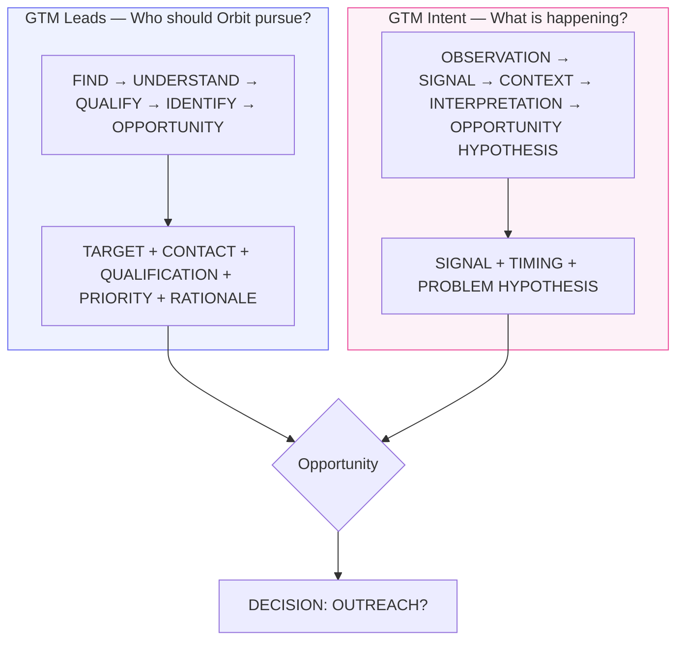
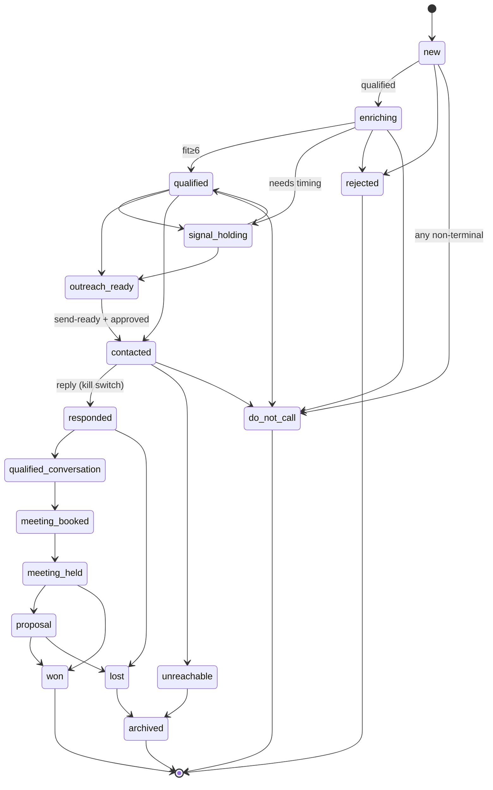
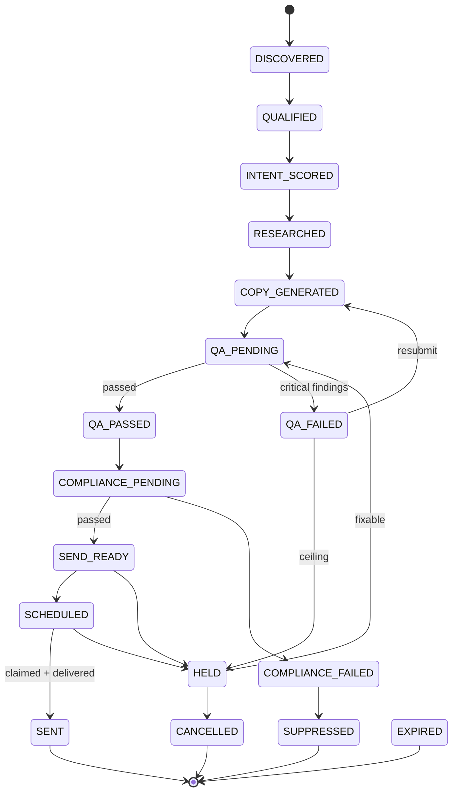
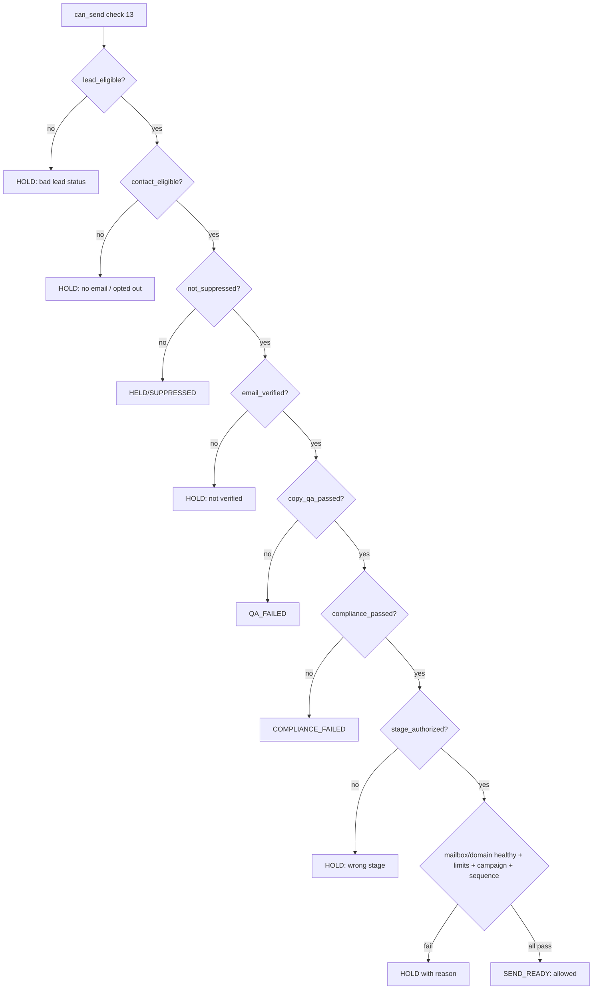
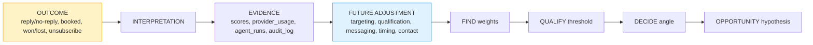
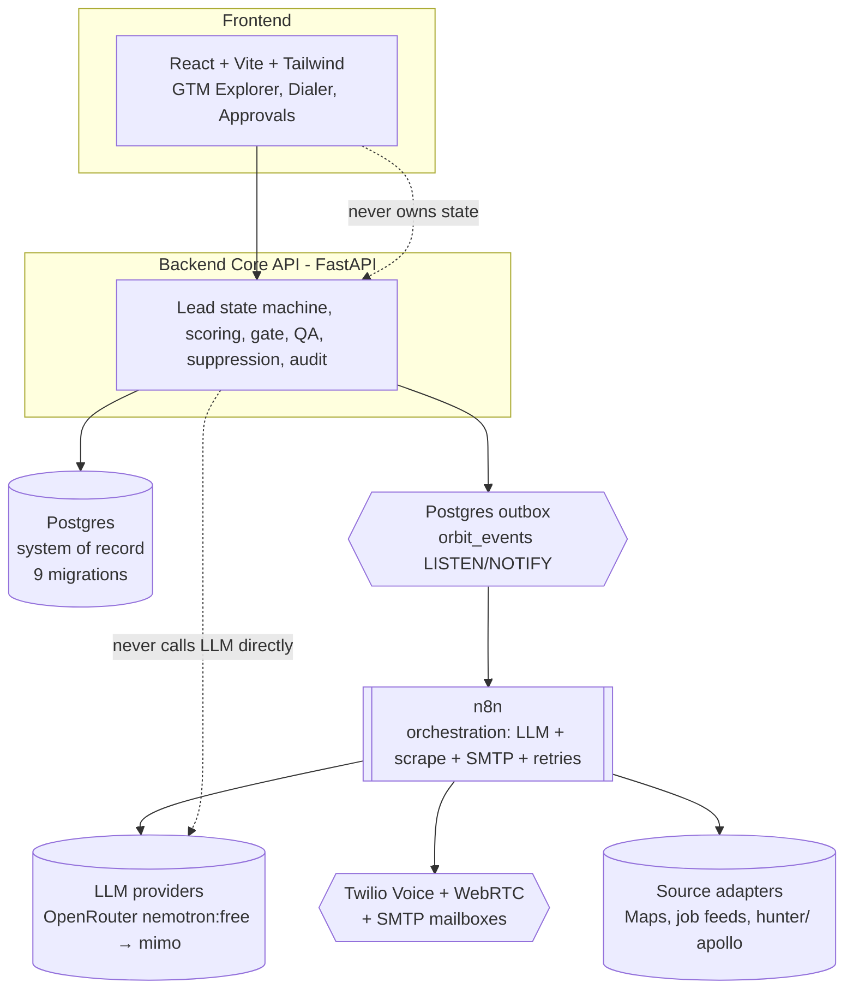
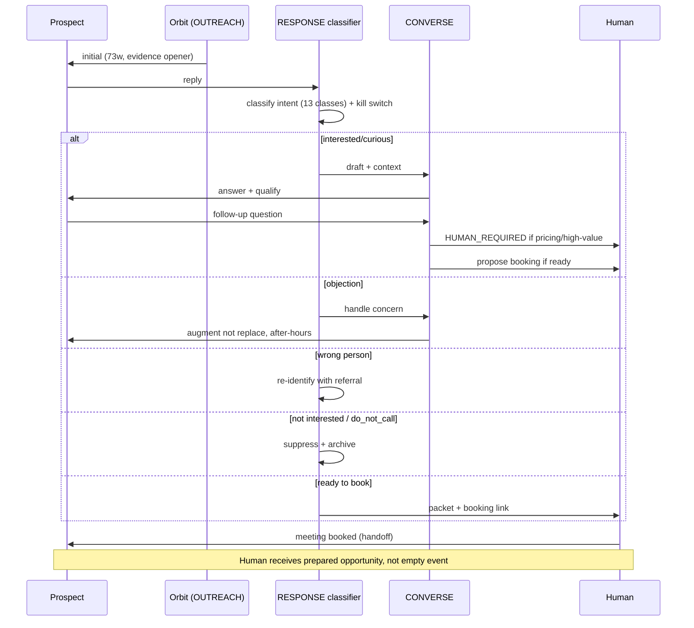
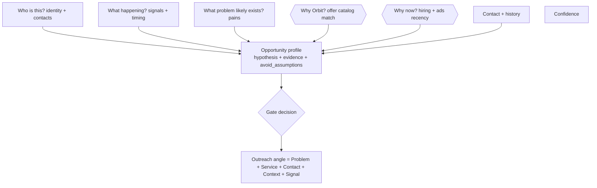
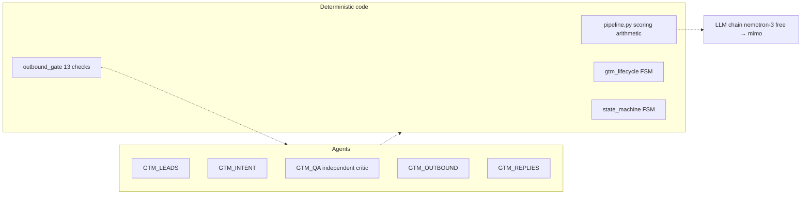

# MERMAID — Canonical diagrams (generated from code, not decoration)

> Each diagram is rendered from the same canonical relationships that power `frontend/src/gtm/canonical.ts` and `services/state_machine.py` / `services/gtm_lifecycle.py`. If diagram ≠ code, file a drift bug.

---

## 1. Overall GTM flow (continuous decision system)

```mermaid
flowchart LR
  FIND[FIND<br/>Business Discovery] --> U[UNDERSTAND<br/>Who is this?]
  U --> Q[QUALIFY<br/>Prioritize P1-P4]
  Q --> IDENT[IDENTIFY<br/>Company→Person→Verified contact]
  IDENT --> OPP[OPPORTUNITY<br/>Hypothesis + evidence + why now]
  OPP --> DECIDE[DECIDE<br/>Angle = Problem+Service+Contact+Signal]
  DECIDE --> GATE{OUTBOUND GATE<br/>13 checks<br/>allowed?}
  GATE -->|allowed}| OUT[OUTREACH<br/>Day0/3/7/14 react to behavior]
  GATE -->|held| HELD[HELD / Review]
  OUT --> RESP{RESPONSE<br/>Classify intent 13 classes}
  RESP -->|question/objection| CONV[CONVERSE<br/>Remember + answer + qualify]
  RESP -->|ready to book| BOOK[BOOK / HANDOFF<br/>Prepared opportunity]
  CONV --> BOOK
  RESP -->|not a fit / later / do_not_call| ARCH[Archived / Nurture]
  BOOK --> LEARN[LEARN<br/>Outcome → evidence → future targeting]
  LEARN -.->|better FIND weights| FIND
  style GATE fill:#fef3c7,stroke:#f59e0b
  style LEARN fill:#fffbeb,stroke:#f59e0b
```

---

## 2. Two brains



---

## 3. Lead state machine (from `services/state_machine.py:6`)



---

## 4. GTM message lifecycle (from `services/gtm_lifecycle.py:31`)



Note: `AUTHORIZED_SEND_STAGES=(SEND_READY,SCHEDULED)` enforced in `services/outbound_gate.py:154`. Legacy `gtm_stage IS NULL` skips QA/compliance/stage checks.

---

## 5. Outbound gate decision tree (13 checks)



---

## 6. Learning loop



Examples: high reply to hiring-pressure → valuable signal; high interest but low booking → CONVERSE→BOOK transition needs fix; poor qualification from source → downgrade.

---

## 7. System layering (from `services/pipeline.py:1` §10.3)



---

## 8. Conversation flow (RESPONSE → CONVERSE → BOOK)



---

## 9. Opportunity synthesis



---

## 10. Agent boundaries



Each agent narrow JSON-in JSON-out, event-driven, model-tiered. QA never generates copy.
